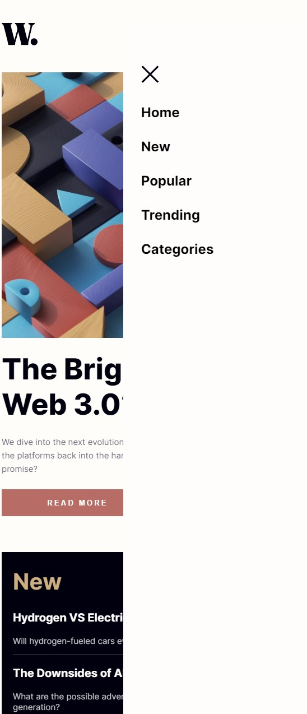

# Frontend Mentor - News homepage solution

This is a solution to the [News homepage challenge on Frontend Mentor](https://www.frontendmentor.io/challenges/news-homepage-H6SWTa1MFl). Frontend Mentor challenges help you improve your coding skills by building realistic projects.

## Table of contents

- [Overview](#overview)
  - [The challenge](#the-challenge)
  - [Screenshots](#screenshots)
  - [Links](#links)
- [My process](#my-process)
  - [Built with](#built-with)
  - [What I learned](#what-i-learned)
  - [Continued development](#continued-development)
- [Author](#author)

**Note: Delete this note and update the table of contents based on what sections you keep.**

## Overview

### The challenge

Users should be able to:

- View the optimal layout for the interface depending on their device's screen size
- See hover and focus states for all interactive elements on the page

### Screenshots




### Links

- Solution URL: [Add solution URL here](https://your-solution-url.com)
- Live Site URL: [Add live site URL here](https://your-live-site-url.com)

## My process

### Built with

- Semantic HTML5 markup
- CSS custom properties
- Flexbox
- CSS Grid
- Javascript

### What I learned

- CSS grid

```
main {
  display: grid;
  grid-template-columns: repeat(3, 1fr);
  row-gap: 48px;
  column-gap: 24px;
  justify-items: stretch;
  align-items: stretch;
}
```

- JS getElementById

```
function openNav() {
  document.getElementById("sidebarNav").style.width = "60%";
  document.getElementById("body").style.filter = "grayscale(50%)";
}

function closeNav() {
  document.getElementById("sidebarNav").style.width = "0%";
  document.getElementById("body").style.filter = "grayscale(0%)";
}
```

### Continued development

- To learn more vanilla javascript to make my projects interactive
- To make complex grid systems

## Author

- Website - [Rowan Murray](https://www.rowmur.com)
- Frontend Mentor - [@RowMur](https://www.frontendmentor.io/profile/RowMur)
